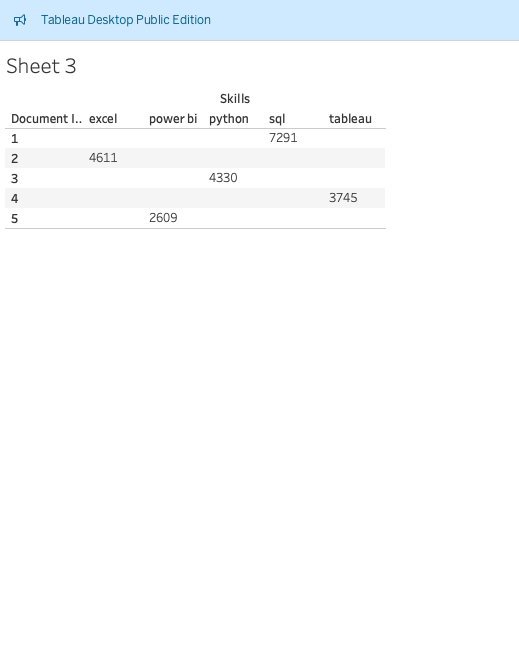

# Introduction

📊 This contains data of a job market in 2023.This project is targeting Data analyst roles on how much are the top paying roles💰,which skills are most in demand, and where high demands meets high salaries in data analytics🔥. Using Sql as the primary tool the analysis is structured around 5 key questions.Each answered through a dedicated sql uery. The goal is to provide clear insigts into salary trends, valuable skills and how data analyst can position themselves competitively in today's market.
    
🔎 SQL queries ? check them out : [project_sql folder](/project_sql/) 
    
#  Background 
So the reason for this project was to better understand what the job market looks like for Data Analyst roles in 2023. I wanted to explore which skills employers are looking for the most, which roles offer the highest salaries, and how different skills impact both pay and demand. By breaking the data down using SQL, I was able to get a clearer picture of what is happening in the industry and what skills are worth focusing on for career growth.

 # Tools I Used 
 - SQl: Used it to query the database and extract ket insights form the job posting data.
 - PostgreSQL: This is the database management system used to store and manage the dataset efficiently.
 - Tableau: This turned the analysis into more of a visual representation, making it easier to read and notice the trends happening.
 - Visual studio code: This was the IDE used for database mannagement and executing sql files .
 - GitHub : essesntial for version control cloud back up and sharing the project.

 # The Analysis

- 01_top_paying_jobs. I noticed the top 10 most-paying jobs in the database, and I broke it down as shown by my SQL queries.

    ```sql
    SELECT
    job_id,
    job_title,
    job_location,
    name as company_name,
    job_schedule_type,
    salary_year_avg,
    job_posted_date
    From 
    job_postings_fact
    LEFT JOIN company_dim ON job_postings_fact.company_id = company_dim.company_id -- Wanted to see the company name 
    Where 
    (job_title_short = 'Data Analyst' AND job_location = 'Anywhere') 
    AND salary_year_avg IS NOT NULL
    order by
        salary_year_avg DESC
    limit 10

 - I created a visual representation on Tableau showing the top 10 paying jobs. I noticed that SmartAsset is the company that pays the most for the Data Analyst role, followed by Health Careers. The company that pays the least is shown here as Pinterest.


- 02_top_paying_job_skills:This analysis checked which skills pay the most for Data Analyst roles.
```sql
WITH top_paying_jobs AS (
    SELECT
        job_id,
        job_title,
        name as company_name,
        salary_year_avg
    From 
        job_postings_fact
    LEFT JOIN company_dim ON job_postings_fact.company_id = company_dim.company_id -- Wanted to see the company name 
    Where 
        (job_title_short = 'Data Analyst' AND job_location = 'Anywhere') 
        AND salary_year_avg IS NOT NULL
        order by
            salary_year_avg DESC
        limit 10
    )
SELECT top_paying_jobs. *,skills 
From 
    top_paying_jobs

INNER JOIN skills_job_dim  ON top_paying_jobs.job_id= skills_job_dim.job_id
INNER JOIN skills_dim ON skills_job_dim.skill_id = skills_dim.skill_id
ORDER BY
    salary_year_avg DESC;

```


- I noticed from the graph below that knowing SQL, Python, and Tableau are the top-paying job skills a Data Analyst should have.

- 03_skills_in_demand: This is similar to the top-paying skills, but I focused on which skills are more in demand. 
```sql
    SELECT
    skills,
    count(skills_job_dim.job_id) AS demand_count
    FROM job_postings_fact
    INNER JOIN skills_job_dim ON job_postings_fact.job_id = skills_job_dim.job_id
    INNER JOIN skills_dim on skills_job_dim.skill_id = skills_dim.skill_id
    WHERE
    job_title_short = 'Data Analyst' AND
    job_work_from_home = TRUE
    GROUP BY
    skills
    ORDER BY 
    demand_count DESC
    LIMIT 5;
```


I made a count and extracted the top 5 skills. SQL starts with 7291, showing that it is in very high demand along with the other skills shown in the image.

- 04_top_paying_skills_based_salary: This shows the top-paying skills for Data Analysts. 
``` sql
SELECT
    skills,
    round (AVG(salary_year_avg),2) As average_salary
FROM job_postings_fact
INNER JOIN skills_job_dim ON job_postings_fact.job_id = skills_job_dim.job_id
INNER JOIN skills_dim on skills_job_dim.skill_id = skills_dim.skill_id
WHERE
job_title_short = 'Data Analyst' 
 AND
 salary_year_avg IS NOT NULL -- removing salries with not values answering the first part of b
AND
job_work_from_home = TRUE
GROUP BY
skills
ORDER BY 
    average_salary DESC 
limit 20;
```


Here I was looking at the average salary associated with each skill, regardless of location . Here you notice that PySpark is a skill that pays more and is a skill to learn and followed by BitBucket.

- 05_optimal_skills: Here is where I looked at the skills with the highest demand and the highest salary.
``` sql
WITH skills_demand AS (
    SELECT
        skills_dim.skill_id,
        skills_dim.skills,
        COUNT(skills_job_dim.job_id) AS demand_count
    FROM job_postings_fact
    INNER JOIN skills_job_dim 
        ON job_postings_fact.job_id = skills_job_dim.job_id
    INNER JOIN skills_dim
        ON skills_job_dim.skill_id = skills_dim.skill_id
    WHERE
        job_title_short = 'Data Analyst'
        AND salary_year_avg IS NOT NULL
        AND job_work_from_home = TRUE
    GROUP BY
        skills_dim.skill_id,
        skills_dim.skills
),

average_salary AS (
    SELECT
        skills_dim.skill_id,
        ROUND(AVG(salary_year_avg), 2) AS average_salary
    FROM job_postings_fact
    INNER JOIN skills_job_dim 
        ON job_postings_fact.job_id = skills_job_dim.job_id
    INNER JOIN skills_dim
        ON skills_job_dim.skill_id = skills_dim.skill_id
    WHERE
        job_title_short = 'Data Analyst'
        AND salary_year_avg IS NOT NULL
        AND job_work_from_home = TRUE
    GROUP BY
        skills_dim.skill_id
)

SELECT
    skills_demand.skill_id,
    skills_demand.skills,
    skills_demand.demand_count,
    average_salary.average_salary
FROM skills_demand
INNER JOIN average_salary 
    ON skills_demand.skill_id = average_salary.skill_id
order BY
    demand_count DESC,
    average_salary DESC
LIMIT 20;
```


 I broke down the table into two parts: one with the highest salary and the other with the highest demand count.

 # What I learned 
- One thing I took from this is that in Data Analyst jobs, certain skills are crucial for a person to learn, such as SQL, Excel, and Python. These skills will help you land jobs as they are in demand. While looking at the highest salaries, I noticed that having a combination of SAS and SQL can give you a high chance of landing a job, as one is high-paying while the other is in high demand. 
 # Conclusions 
 - This project provided a focused look into the 2023 data analytics job market nd showing how skills ,salaries and job demands meet.When looking through the data it became clear which roles offer the highest pay and shkills employers value the most and where data analts can position themsleves for the stronest opportunites 

 - Across all five analyses , the pattern is onsistent and core technical skills such as sql, python and tableau form the foundation of the most high  paying and demand roles.Specialised tools such as pySpark and SAS also stand out for their strong salary potential, showing that exapanding beyond dfoundational skills can create a competitive advantage.

 - Overall this project demonstrartes how data driven insight can guide career decisons and make it easier for a job seeker to work on the kills that make them valuable to the employer.

 # Key areas  to improve
 - This project works as intended, but the use of Tableau to visualize data more clearly is a weakness I am currently working on.
 - Still learning how sql wokrs and the structure behind it but however am improving and passionate on it.

 - This project can use other databases that I can work on, but I focused on one skill and should be more comfortable working with more than one job title.

